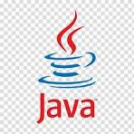

# Hi 👋🏼, I am Willy Nyawira!

Welcome to my GitHub profile 🙏🏼

---
## About Me:

  

### Actuary | Software Developer

*I create algorithms and models that help computers learn from data and make forecasts, resulting in valuable business insights.*

---
### Profile Summary

  

As a dedicated actuary with a strong background in financial modeling, valuation analysis, and business intelligence, I am driven by a passion for leveraging technology to tackle complex challenges. My diverse skill set includes expertise in statistics, mathematics, and data science, complemented by hands-on experience in software development.

**Actuarial and Financial Expertise:**
With a focus on actuarial science, I have successfully completed the Financial Modeling and Valuation Analyst (FMVA) certification, demonstrating proficiency in financial modeling, business forecasting, and valuation techniques. My analytical skills extend to risk assessment, ensuring informed decision-making in financial contexts.
I have worked in a financial institution with experience in bank operations,insurance,money transfers,audit,account management,marketing and digitization.

**Data Science and Business Intelligence:**
In addition to my actuarial background, I bring a wealth of experience in data science and business intelligence. I have applied advanced statistical methods, machine learning, and natural language processing (NLP) to derive meaningful insights from data. My portfolio showcases projects that demonstrate my ability to harness data for strategic decision-making.I also possess a certification in Business Intelligence and Data Analysis-BIDA.

**Continuous Learning and Growth:**
Embracing a mindset of lifelong learning, I stay abreast of industry trends and advancements. My commitment to personal and professional growth is reflected in my proactive approach to acquiring new skills and exploring emerging technologies.

**Collaboration and Impact:**
I am dedicated to making a meaningful impact at the intersection of actuarial science, data science, and software development. My GitHub portfolio showcases my contributions and projects, demonstrating my commitment to excellence. If you share a vision for collaborative innovation and lasting impact, I invite you to reach out for potential collaboration at 📫 nyawiramwangi394@gmail.com.

Let's embark on a journey of mutual growth and professional advancement.

  

#### Professional Links:

---
## Domains of Interests & Expertise
:comet: Actuarial Science  
:comet: Statistics  
:comet: FMVA  
:comet: Software Developer  
:comet: Business Intelligence  
:comet: Data Analysis  
:comet: Database Administration  
:comet: Banking  
:comet: Oracle Apps Developer  
:comet: Newgen Apps Developer  

---
## Skills 

### Languages, Libraries, Tools and Frameworks: 
 

    
    
    
    
    <!--  -->
    
    
    
    
    <!--  -->
    
    <!--  -->
    <!--  -->
    <!--  -->
    
    
    
    
    <!-- 
     -->
    
    
    
    
    
    
    
    
   

---
### 💻 Programming

 
---
### 💾 Database Management

### 📷 Image Processing

 
### 📊 Data Visualization

<!-- ### 🤖 ML/DL Frameworks

 

 -->
<!-- ### 🗣️ NLP

 -->
### 🤖 AI/ML Applications 

 
 
 
 
 
 
---
### 📊 Data Science and ML

---
### :cloud: AWS

 

---
### 📜 Miscellaneous

 

 

---

 

  
Thank you for taking time to visit my GitHub profile!
I really appreciate 🙏🏼

---

